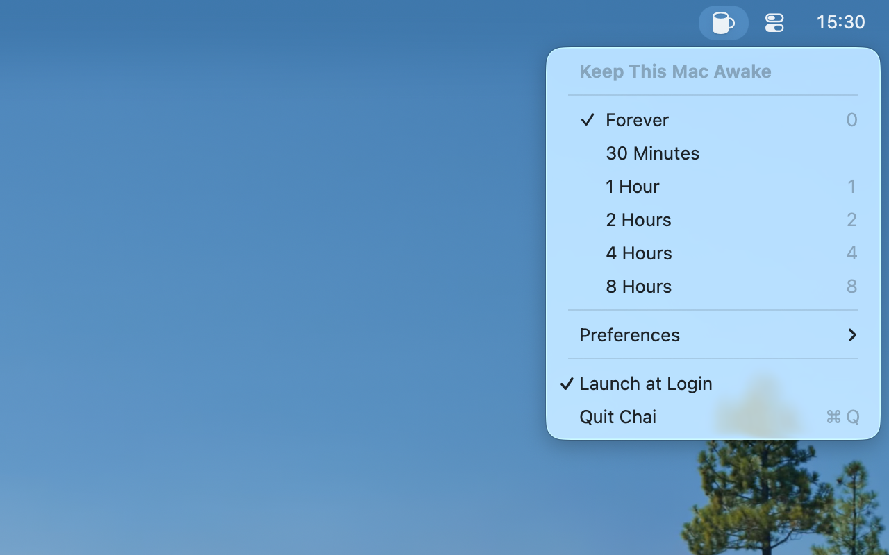

# Chai

_Don't let your Mac fall asleep, like a sir_

--------------------------------------------------------------------------------

This fork adds two preferences on top of [lvillani/chai](https://github.com/lvillani/chai):

* **Keep Awake When Lid Is Closed** — keeps the Mac running even in clamshell mode. Closing the
  lid forces sleep regardless of power assertions, so this runs `pmset disablesleep 1` while Chai
  is active (and `0` when it deactivates or quits). That requires administrator privileges: Chai
  first tries a passwordless `sudo -n`, then falls back to a password prompt. To avoid the prompt,
  add a sudoers rule:

      echo "$USER ALL=(root) NOPASSWD: /usr/bin/pmset disablesleep 0, /usr/bin/pmset disablesleep 1" \
        | sudo tee /etc/sudoers.d/chai

  ⚠️ With the lid closed the fans have reduced airflow — avoid putting the machine in a bag while
  this is engaged. If Chai crashes (rather than quitting normally) the override stays on until
  reboot or `sudo pmset disablesleep 0`.

* **Keep Awake on Battery** (on by default) — when turned off, Chai pauses automatically while on
  battery power and resumes when reconnected to AC, so a "Forever" activation doesn't drain the
  battery.

Because of the `pmset` integration, this fork does not run in the App Sandbox.

## Installation

Build from source (requires Xcode command line tools):

    ./script/build
    cp -r .build/release/Chai.app /Applications/

## How Does It Look?

## Don't We Have Caffeine Already?

Chai is better than [Caffeine](http://lightheadsw.com/caffeine/) in a number of ways:

* It is open source, so we have nothing to hide.
* It uses [power assertions][IOPMLib] to keep your Mac awake.
* It runs in the [sandbox][sandbox] to keep your Mac secure.

## Icons

Icons are licensed from [Glyphish](http://glyphish.com) and cannot be used outside this project.

[IOPMLib]:
https://developer.apple.com/library/mac/documentation/IOKit/Reference/IOPMLib_header_reference/

[sandbox]:
https://developer.apple.com/library/mac/documentation/Security/Conceptual/AppSandboxDesignGuide/AboutAppSandbox/AboutAppSandbox.html
